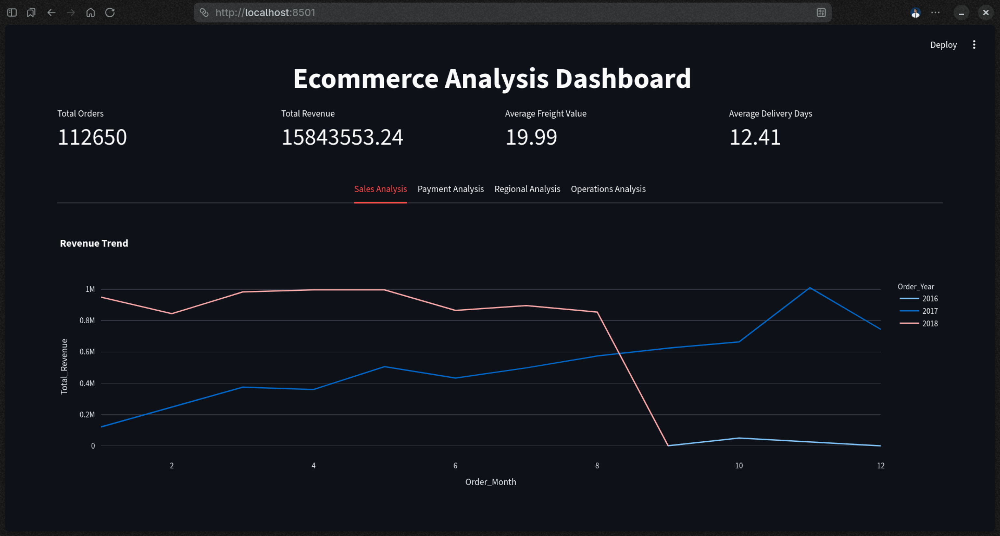
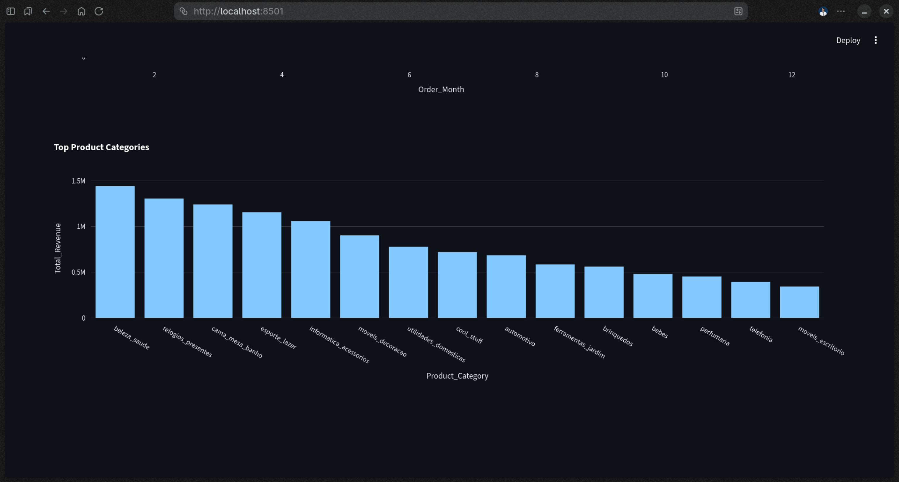
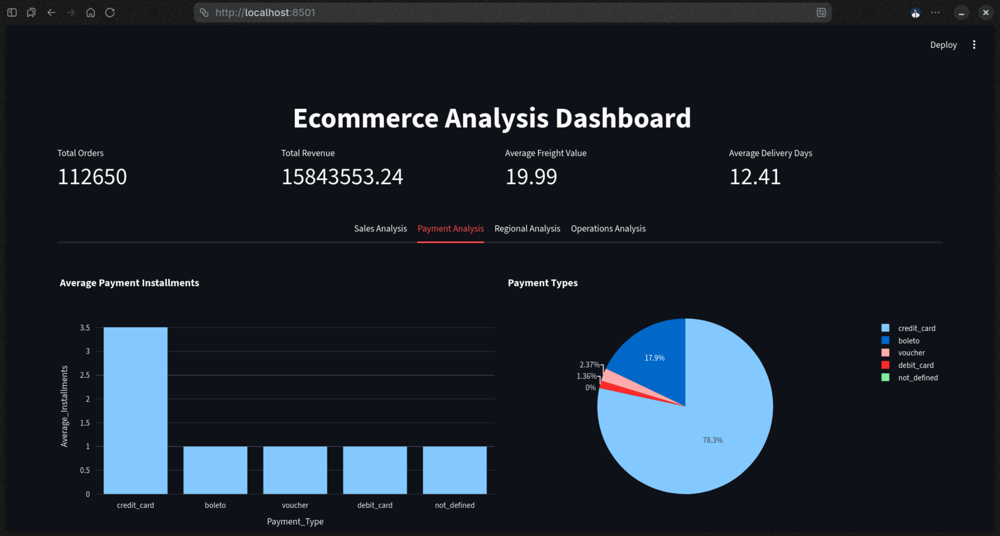
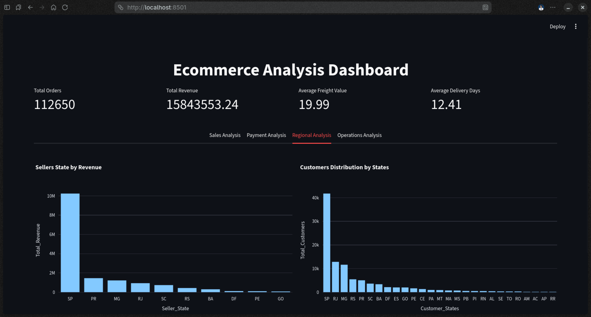
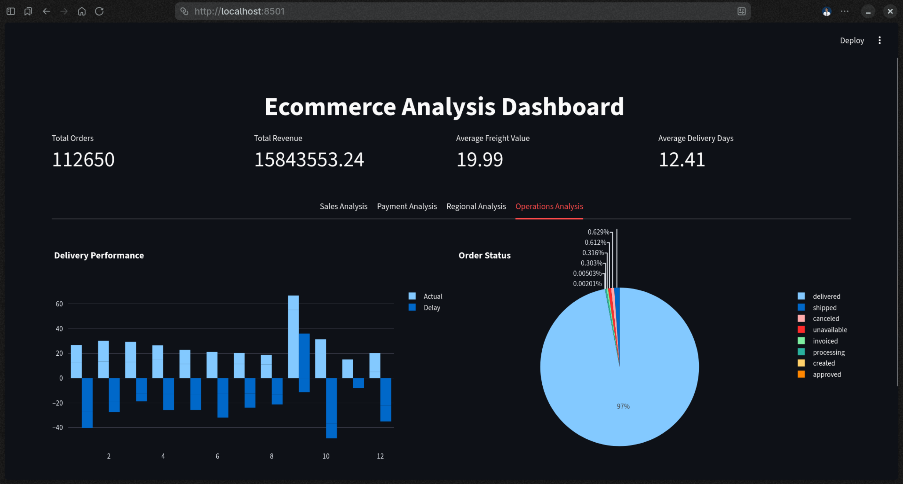

# Ecommerce-Analysis

Project for E-commerce Data Analysis using MySQL for ETL and Python, deployed with an interactive Streamlit dashboard.

## Live Dashboard

[View Dashboard]()

---

## Project Overview

This project analyzes Brazilian e-commerce data from the Olist dataset. The purpose is to uncover business insights across revenue trends, payment behavior, regional performance, and delivery operations using SQL and an interactive Python dashboard.

---

## Tools

- **MySQL** — data storage, ETL, feature engineering, analytical views
- **Python** — data loading and dashboard
- **Streamlit** — interactive dashboard
- **Plotly** — data visualizations
- **SQLAlchemy + PyMySQL** — database connection
- **Pandas** — data handling

---

## Project Structure

```bash
Ecommerce-Analysis/
├── data/
├── sql/
│   ├── transform.sql
│   ├── extract.sql
│   └── view.sql
├── app.py
├── utils.py
├── charts.py
├── db.py
├── load_data.py
├── requirements.txt
└── .env
```

---

## Dataset

- **Source:** Brazilian E-Commerce Public Dataset by Olist
- **Link:** https://www.kaggle.com/datasets/olistbr/brazilian-ecommerce
- **Size:** 100k+ orders across 6 tables

---

## ETL Process

1. Raw CSVs loaded into MySQL via Python/SQLAlchemy

2. Dropped unnecessary tables and columns (`transform.sql`)

3. Date type conversions from text to DATE

4. Feature engineering (`extract.sql`):
   
   - Delivery Days
   
   - Delivery Delay Days
   
   - Order Year, Month, Quarter
   
   - Total Item Value

---

## SQL Views

| View                             | Description                               |
| -------------------------------- | ----------------------------------------- |
| Revenue_Trend_View               | Monthly and yearly revenue trend          |
| Top_Categories_View              | Top 15 product categories by revenue      |
| Payment_Type_Breakdown_View      | Payment count and value by type           |
| Average_Payment_Installment_View | Average installments by payment type      |
| Top_Seller_States_View           | Top seller states by revenue              |
| Customer_State_Distribution_View | Customer count by state                   |
| Order_Status_Breakdown_View      | Order count by status                     |
| Delivery_Performance_View        | Average actual vs estimated delivery days |

---

## Dashboard Features

- KPI cards — Total Orders, Total Revenue, Avg Freight Value, Avg Delivery Days
- Sales Analysis — Revenue Trend, Top Product Categories
- Payments — Payment Type Breakdown, Avg Installments
- Regional — Seller State Revenue, Customer Distribution
- Operations — Order Status, Delivery Performance

---

## Screenshots











---

## Setup

**1. Clone the Repository**

```bash
git clone https://github.com/Moiz-205/Ecommerce-Analysis.git
cd Ecommerce-Analysis
```

**2. Create virtual environment**

```bash
python -m venv .venv
source .venv/bin/activate
pip install -r requirements.txt
```

**3. Configure `.env`**

```bash
DB_USER=your_mysql_username
DB_PASSWORD=your_mysql_password
DB_HOST=localhost
DB_NAME=ecommerce_db
```

**4. Load data into MySQL**

```bash
python db.py
python load_data.py
```

**5. Run SQL files in order**

```bash
mysql -u root -p ecommerce_db < sql/transform.sql
mysql -u root -p ecommerce_db < sql/extract.sql
mysql -u root -p ecommerce_db < sql/view.sql
```

**6. Run the dashboard**

```bash
streamlit run app.py
```

---

## License

This project is licensed under the [GNU General Public License v3.0](https://www.gnu.org/licenses/gpl-3.0.en.html).
